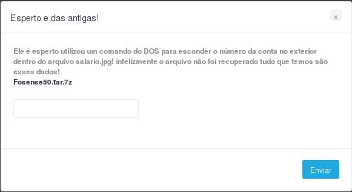
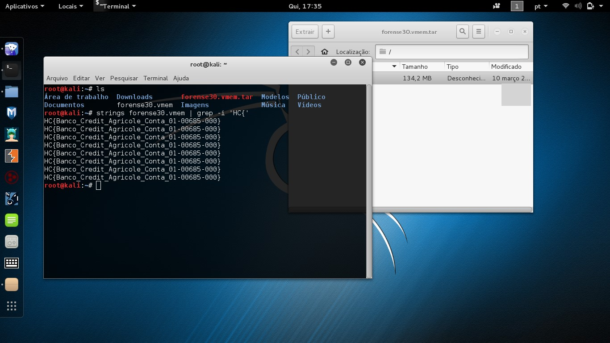
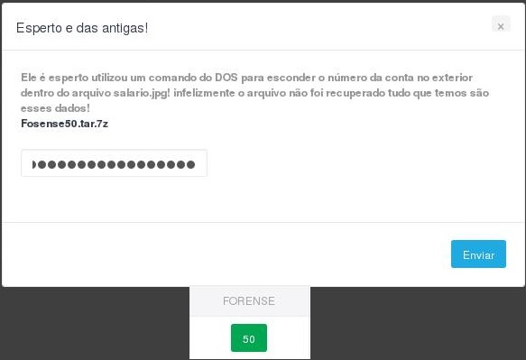

# SucuriHC OPERAÇÃO LAVA JATO 
#(FORENSE 50)
#Esperto e das antigas!
>Ele é esperto utilizou um comando do DOS para esconder o número da conta no exterior dentro do arquivo salario.jpg!
infelizmente o arquivo não foi recuperado tudo que temos são esses dados! 
Fosense50.tar.7z


#Resolvendo
Esse era um desafio digno de um ```Esperto e das antigas ```.

O site liberava um arquivo ```Fosense50.tar.7z``` contendo uma file ```.vmem``` compactada
à qual você teria que explorar, a flag estava supostamente econdida dentro desse arquivo

#Rápido e Simples
O que eu fiz foi usar um comando para pesquisar o inicio da flag ```HC{``` nas strings do arquivo.

>strings ARQUIVO.vmem | grep -i 'HC{'



#Flag
> HC{Banco_Credit_Agricole_Conta_01-00685-000}



> Por: folds - BIG BANG TEAM


